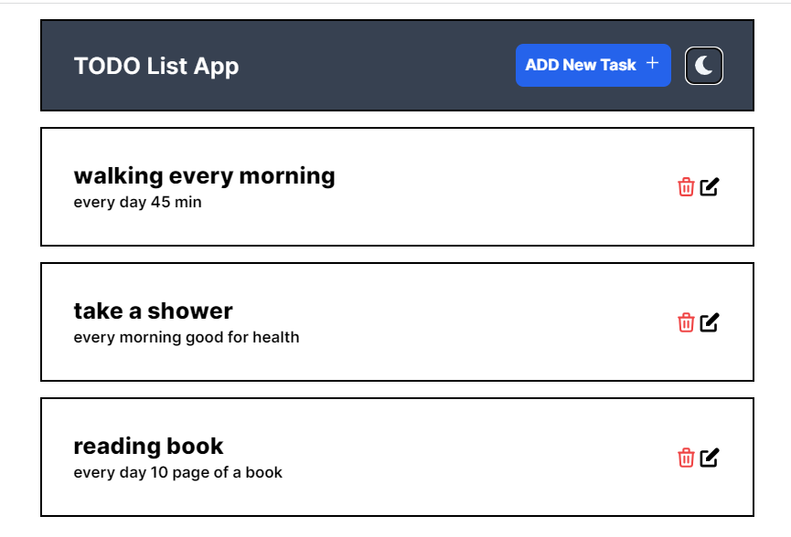

<h1 align="center">CRUD Nextjs App  📝</h1>  

  🖊️ A simple Todo App built using <a href="https://nextjs.org/blog/next-13">Nextjs</a> and <a href="https://tailwindcss.com">Tailwind css</a> and <a href="https://cloud.mongodb.com/">MongoDB</a>

## This is a simple Todo App built using ReactNext.js and styled using Tailwind css.

# picture Demo

## 😃 Features:

- ➕ Add todos
- 🗑️ Delete todos
- 🖊️ Edit todos
- 🌙 Light \ dark mode

  ❤️ Feel free to create issues and contributions for features or bugs to this project.

